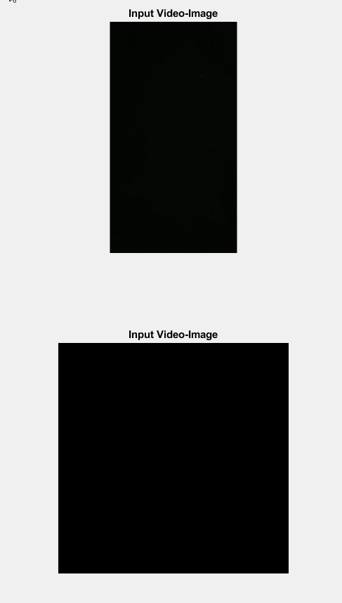

# Identificador de Face de Dado

Um programa simples feito para detectar o número correspondente a face superior de um dado em um arquivo de video.
Foi feito para a avaliação N1 do professor Arlindo da Puc Goiás da disciplina de Visão Computacional.

# Exemplo

